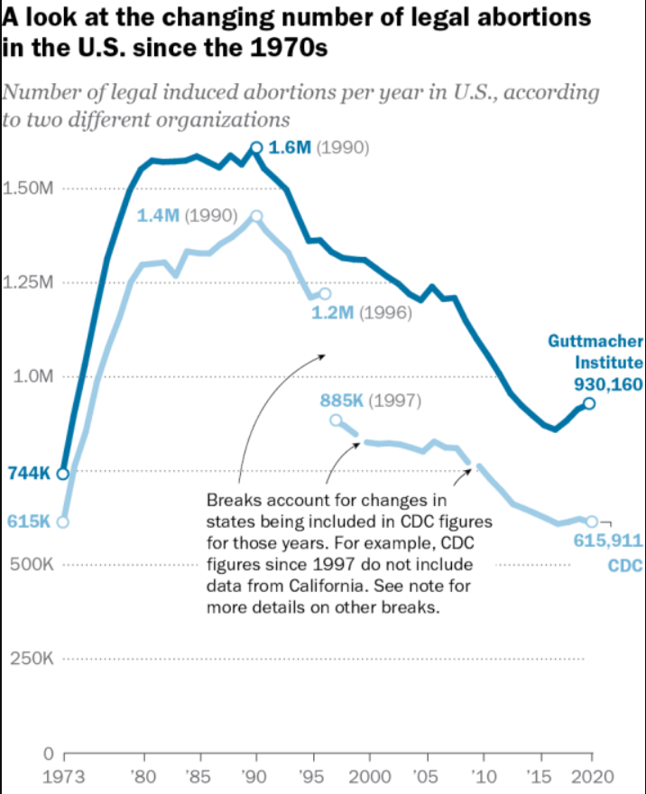

```{r setup, include=FALSE}
knitr::opts_chunk$set(echo = TRUE)
```

# Take a look about the topic

  - Overview of the topic
  
  - Importance of understanding historical trends
  
  - Goals of the presentation

# Introduction
  - Pew Research Center has conducted many surveys about abortion over the years, providing a lens into Americans’ views on whether the procedure should be legal, among a host of other questions.
  
  - After the Supreme Court’s June 2022 decision to end the constitutional right to abortion, 62% of U.S. adults said the practice should be legal.
  
    - We will take a look at data on the number of legal abortions that take place in the United States each year – and other related measures – by the Guttmacher Institute, which have tracked these patterns for several decades. The latest data from both organizations is from 2020, and also some collected data that provided by the Centers for Disease Control and Prevention (CDC). 

# Data Resource

   - Data taking from the work of The Guttmacher Institute.
   
   **Pregnancies, Births and Abortions in the United States: National and State Trends by Age Data Set (1988–2017)**
   
   - Guttmacher data sets website: 
   <a href="https://www.guttmacher.org/public-use-datasets" style="color:pink;">
   https://www.guttmacher.org/public-use-datasets
   </a>
   
   
   - The Institute compiles comprehensive statistics on the incidence of pregnancy, birth and abortion for people in all reproductive age-groups in the United States at the national level (1973–2017) and state level (1988–2017).
   
   - Data set has been modified at 2021 so the information is the current newest one.

# Data Resource (Continous)

   **Abortion Surveillance — United States, 2019**
  
  - Link: 
  <a href="https://www.cdc.gov/mmwr/volumes/70/ss/ss7009a1.htm#T14_down" style="color:pink;">
  https://www.cdc.gov/mmwr/volumes/70/ss/ss7009a1.htm#T14_down
  </a>
  
  - Author: 
  Katherine Kortsmit, PhD; Michele G. Mandel; Jennifer A. Reeves, MD; Elizabeth Clark, MD; H. Pamela Pagano, DrPH; Antoinette Nguyen, MD; Emily E. Petersen, MD; Maura K. Whiteman, PhD
  
  - Release Date: November 26, 2021
  
  **Texas and The U.S. population data set**
  - Link: 
  <a href="https://www.tsl.texas.gov/ref/abouttx/census.html" style="color:pink;">
  https://www.tsl.texas.gov/ref/abouttx/census.html
  </a>
  
  - Sources:
  Forstall, Richard L. Population of States and Counties of the United States: 1790 to 1990. U.S. Bureau of the Census, Washington, DC, 1996.
  
  - Release Date: NA, last modified January 8, 2020
  
  - Another data set to support The U.S. population:
  <a href="https://www.macrotrends.net/states/texas/population" style="color:pink;">
  https://www.macrotrends.net/states/texas/population
  </a> 
  
  - Retrieved 2023-04-27.
  
# Library import
```{r message=FALSE, warning=FALSE}
library(dplyr)
library(tidyverse)
library(stringr)
library(ggplot2)
```
# So, what are the data sets we will working with?
```{r}
abortion_data_UnS <- read.csv(
"https://raw.githubusercontent.com/nhanizDee/R--for-data-science/main/NationalAndStatePregnancy_PublicUse.csv")

abortion_data_UnS %>% glimpse(n.max = 6, width = F)
```

# 
```{r message=FALSE, warning=FALSE}
population_data <- read.csv('State_Population.csv')

texas_population <- read.csv('Texas Population.csv')

glimpse(population_data)
glimpse(texas_population)

```

# How many abortions are there in the U.S. each year?
- An exact answer is hard to come by. 
  
  - The CDC and the Guttmacher Institute each try to measure this, but they use different methods and publish different figures.

- The CDC compiles figures voluntarily reported by the central health agencies of the vast majority of states.

- Its latest totals do not include figures from California, Maryland or New Hampshire.

- On the other hand, The Guttmacher Institute compiles its figures after contacting every known provider of abortions – clinics, hospitals and physicians’ offices – in the country.

 - Guttmacher’s figures are higher than the CDC’s in part because it includes data from all 50 states.
 
# Let's first take a look at the number in the whole country by time:

```{r echo=FALSE, out.width = "40%", fig.align = "center"}

```


# After that, let working on some specific states to see how it is going around us

- Suppose we want to know how the data changes in the most populous and least populated states according to the data we have.

Take a first look about population, here is the top 6 of highest and lowest 

```{r}
top_6_population <- population_data %>% filter(Ranked < 4 | Ranked > 45) %>%
  select('Ranked','State.Name', 'Population')

top_6_population
```


```{r echo = FALSE}
# Get the current row names of the data frame
old_col_names <- colnames(abortion_data_UnS)

# Replace the "abortionrate" prefix with "rate_"
new_col_names <- gsub("abortionrate", "rate_", old_col_names)

# Set the new row names for the data frame
colnames(abortion_data_UnS) <- new_col_names
```
# Let's take a look about the higest population state we have here- California:

```{r, echo=FALSE, warning=FALSE}

CA_abortion_data <- abortion_data_UnS %>% filter(state == "CA") %>%  
  select(Year = year, rate_lt15, rate_lt20, rate_3034, rate_40plus)

```
The first graph is a facetted line plot of rate vs. year

```{r CA General Plot, echo=FALSE, warning=FALSE}
# Reshape the data frame into long format
mydata_long <- tidyr::gather(CA_abortion_data, key = "rate", value = "value", -Year)

# Create a facetted line plot of rate vs. year
mydata_long %>% ggplot(aes(x = Year, y = value, color = rate)) +
  geom_line(size = 0.7) +
  facet_wrap(~rate, scales = "free_y") +
  labs(x = "Year",
       y = "Rate",
       title = "Abortion Rates of CA over time")
```

Or, using geom_area to have a better view

```{r echo=FALSE, warning=FALSE}
# Create a area plot of rate
mydata_long %>% ggplot(aes(x = Year, y = value, fill = rate)) +
  geom_area(alpha = 0.5) +
  labs(x = "Year",
       y = "Rate",
        title = "Rates over Time (Stacked)") +
  scale_fill_brewer(palette = "Set1")

```

#
The second graph is a facetted histogram of rate, with each rate displayed in its own panel.
```{r echo=FALSE, warning=FALSE}

# Create a facetted histogram plot of rate
mydata_long %>% ggplot( aes(x = value, fill = rate)) +
  geom_histogram(alpha = 0.5, binwidth = 2) +
  facet_wrap(~rate, scales = "free_y") +
  labs(x = "Rate",
       y = "Frequency",
       title = "Histogram of Rates") +
  scale_fill_brewer(palette = "Set1")
```

The main difference between the two graphs is that the line plot displays the change in rate over time, while the histogram displays the distribution of rates at each point in time. 

The line plot provides a visual representation of trends in the data, while the histogram provides a visual representation of the distribution of data.

# How about the state with the lowest population- Wyoming?

```{r, echo=FALSE, warning=FALSE}

WY_abortion_data <- abortion_data_UnS %>% filter(state == "WY") %>%  
  select(Year = year, rate_lt15, rate_lt20, rate_3034, rate_40plus)

```

```{r WY General Plot, echo=FALSE, warning=FALSE}
# Reshape the data frame into long format
mydata_long2 <- tidyr::gather(WY_abortion_data, key = "rate", value = "value", -Year)
mydata_long2 <- mydata_long2[!is.na(mydata_long$value),]

# Create a line graph of year vs. rate
mydata_long2 %>% ggplot(aes(x = Year, y = value, color = rate)) +
  geom_line(size = 0.7) +
  labs(x = "Year",
       y = "Rate",
       title = "Abortion Rates of WY over time") +
  scale_color_brewer(palette = "Set1")

```

```{r echo=FALSE, warning=FALSE}
# Create an area graph of year vs. rate
mydata_long2 %>% ggplot(aes(x = rate, y = value)) +
  geom_boxplot(color = "black", fill = "lightblue") +
  labs(x = "Rate",
       y = "Value",
       title = "Distribution of Rates") +
  scale_x_discrete(labels = c("rate_lt15", "rate_lt20", "rate_3034", "rate_40plus"))

```

# 

- We are living in Texas, why don't we take a look on the data of Texas!

- However, before jumping into the data, we should know that Texas has banned abortions along with some other states.

- Here is the map of banned states:

```{r echo=FALSE, out.width = "60%", fig.align = "center"}
knitr::include_graphics("status-of-abortion-bans-in-the-united-states-as-of-april-25-2023.png")
```

For more information, you can take a look on this site:

<a href = "https://www.kff.org/womens-health-policy/dashboard/abortion-in-the-u-s-dashboard/#state" style="color:pink;">
https://www.kff.org/womens-health-policy/dashboard/abortion-in-the-u-s-dashboard/#state
</a>

#

```{r, echo=FALSE, warning=FALSE}
years <- c(1988, 2005:2017)
year_subset <- abortion_data_UnS %>% 
  filter(year %in% years)

TX_abortion_data <- year_subset %>% 
  filter(state == "TX") %>% 
  select(Year= year, rate_lt20, rate_2024, rate_2529, rate_3034, rate_3539, rate_40plus, abortionslt20:abortions40plus)

old_col_names2 <- colnames(TX_abortion_data)
# Replace the "abortions" prefix with "rate_"
new_col_names2 <- gsub("abortions", "case_", old_col_names2)

# Set the new row names for the data frame
colnames(TX_abortion_data) <- new_col_names2

```
```{r}
glimpse(TX_abortion_data)
```

#
Some discussion about Texas current situation:
 - Before Roe v. Wade was overturned, at least 50,000 Texans received abortions in the state each year.
   
   - "Texas already had one of the most restrictive abortion laws in the country. After a law prohibiting abortions after about six weeks into a pregnancy took effect Sept. 1, 2021(now banned), the number of abortions statewide from September to December dropped by 46% compared with the same period in 2020, according to preliminary data from the Texas Health and Human Services Commission."
   
 - Here how is it look like as a graph

```{r , echo= FALSE}
#line graph for all rate by year
TX_abortion_data %>% ggplot(aes(x = Year)) + 
  geom_line(aes(y=rate_lt20, color="Rate lt20")) + 
  geom_line(aes(y=rate_2024, color="Rate 2024")) +
  geom_line(aes(y=rate_2529, color="Rate 2529")) + 
  geom_line(aes(y=rate_3034, color="Rate 3034")) +
  geom_line(aes(y=rate_3539, color="Rate 3539")) + 
  geom_line(aes(y=rate_40plus, color="Rate 40+")) + 
  scale_color_manual(name="Rates",
                     values=c("blue","red","green","purple","orange","black")) +
  labs(title="Rates by Year",
       x="Year",
       y="Rate")
```

# Abortion Rates by Age Group in the US, 1988, 2005-2017

```{r , echo= FALSE, warning=FALSE}
abortion_data_long <- TX_abortion_data %>%
  pivot_longer(cols = starts_with("rate"), names_to = "age_group", values_to = "abortion_rate")

ggplot(data = abortion_data_long, aes(x = Year, y = abortion_rate)) + 
  geom_bar(stat = "identity", fill = "darkcyan") +
  labs(title = "Abortion Rates by Age Group in the US, 1988, 2005-2017",
       x = "Year",
       y = "Abortion Rate",
       fill = "Age Group") +
  facet_wrap(~ age_group, scales = "free_y")
```

# Abortion Case by Age Group in the US, 1988, 2005-2017

```{r , echo= FALSE, warning=FALSE}
abortion_data_long <- TX_abortion_data %>%
  pivot_longer(cols = starts_with("case"), names_to = "age_group", values_to = "abortion_case")

ggplot(data = abortion_data_long, aes(x = Year, y = abortion_case)) + 
  geom_bar(stat = "identity", fill = "darkcyan") +
  labs(title = "Abortion Cases by Age Group in the US, 1988, 2005-2017",
       x = "Year",
       y = "Abortion Cases",
       fill = "Age Group") +
  facet_wrap(~ age_group, scales = "free_y")
```

#
- But the hardest thing to working on is data for all case that ages lower than 20.

- Texas tops the nation in teens who give birth multiple times.

- More than 1 in 6 teenagers who gave birth in Texas in 2020 already had a child.

- Here is the reason why: Texas does not require sex education and has the strictest abortion law in the nation.

- Information was analysis by The Texas Tribune using data from the Centers for Disease Control and Prevention.

- In the last decade, the state has been in the top five states for repeat teen birth rates.

<a href = "https://www.texastribune.org/2022/05/09/texas-abortions-by-the-numbers/" style="color:pink;">
  https://www.texastribune.org/2022/05/09/texas-abortions-by-the-numbers/
</a> 


<a href = "https://www.texastribune.org/2022/02/21/texas-teenage-pregnancy-abortion/" style="color:pink;">
  https://www.texastribune.org/2022/02/21/texas-teenage-pregnancy-abortion/
</a>


#  Some summary for the data(correction in Jan. 13, 2023):

- The vast majority of abortions occur during the first trimester of a pregnancy. In 2020, 93% of abortions occurred during the first trimester – that is, at or before 13 weeks of gestation, according to the CDC. An additional 6% occurred between 14 and 20 weeks of pregnancy, and 1% were performed at 21 weeks or more of gestation. These CDC figures include data from 40 states and New York City (but not the rest of New York).

- In the 46 states that reported data to the CDC in 2020, the majority of women who had abortions (57%) were in their 20s, while about three-in-ten (31%) were in their 30s. Teens ages 13 to 19 accounted for 8% of those who had abortions, while women in their 40s accounted for 4%.

- The vast majority of women who had abortions in 2020 were unmarried (86%), while married women accounted for 14%, according to the CDC, which had data on this from 39 states and New York City (but not the rest of New York).

- The reason why i finally using the data in 2020 to give the summary is because the rate change in between 2017- 2020 is not too much that we need to separate so i want to end with the newest data we can approach.

Information collected in this article:

<a href = "https://www.pewresearch.org/short-reads/2023/01/11/what-the-data-says-about-abortion-in-the-u-s-2/" style="color:pink;">
  https://www.pewresearch.org/short-reads/2023/01/11/what-the-data-says-about-abortion-in-the-u-s-2/
</a>


