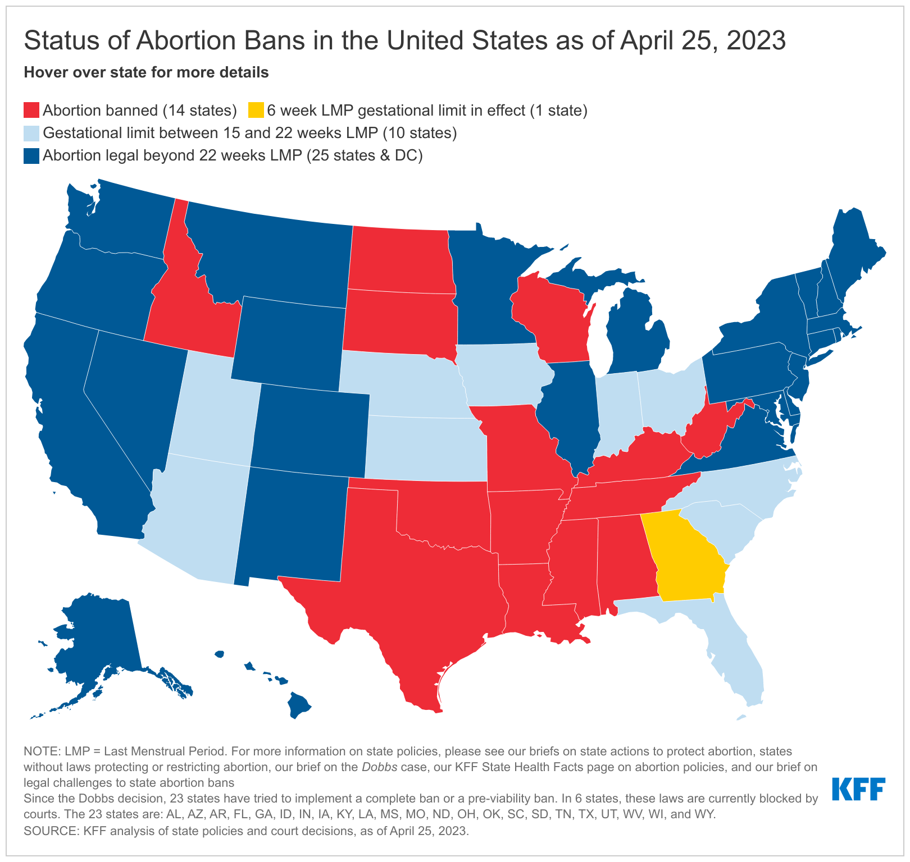

```{r setup, include=FALSE}
knitr::opts_chunk$set(echo = TRUE)
```

# Take a look about the topic

  - Overview of the topic
  
  - Importance of understanding historical trends
  
  - Goals of the presentation

# Introduction
  - Pew Research Center has conducted many surveys about abortion over the years, providing a lens into Americans’ views on whether the procedure should be legal, among a host of other questions.
  
  - After the Supreme Court’s June 2022 decision to end the constitutional right to abortion, 62% of U.S. adults said the practice should be legal.
  
    - We will take a look at data on the number of legal abortions that take place in the United States each year – and other related measures – made by the Guttmacher Institute, which have tracked these patterns for several decades. The latest data is 2017(an update organizations was made in 2020).
# Data Resource

   - Data taking from the work of The Guttmacher Institute.
   
   **Pregnancies, Births and Abortions in the United States: National and State Trends by Age Data Set (1988–2017)**
   
   - Guttmacher data sets website: 
   <a href="https://www.guttmacher.org/public-use-datasets" style="color:pink;">
   https://www.guttmacher.org/public-use-datasets
   </a>
   
   
   - The Institute compiles comprehensive statistics on the incidence of pregnancy, birth and abortion for people in all reproductive age-groups in the United States at the national level (1973–2017) and state level (1988–2017).
   
   - Data set has been modified at 2021 so the information is the current newest one.

# Data Resource (Continous)

   **Abortion Surveillance — United States, 2019**
  
  - Link: 
  <a href="https://www.cdc.gov/mmwr/volumes/70/ss/ss7009a1.htm#T14_down" style="color:pink;">
  https://www.cdc.gov/mmwr/volumes/70/ss/ss7009a1.htm#T14_down
  </a>
  
  - Author: 
  Katherine Kortsmit, PhD; Michele G. Mandel; Jennifer A. Reeves, MD; Elizabeth Clark, MD; H. Pamela Pagano, DrPH; Antoinette Nguyen, MD; Emily E. Petersen, MD; Maura K. Whiteman, PhD
  
  - Release Date: November 26, 2021
  
  **Texas and The U.S. population data set**
  - Link: 
  <a href="https://www.tsl.texas.gov/ref/abouttx/census.html" style="color:pink;">
  https://www.tsl.texas.gov/ref/abouttx/census.html
  </a>
  
  - Sources:
  Forstall, Richard L. Population of States and Counties of the United States: 1790 to 1990. U.S. Bureau of the Census, Washington, DC, 1996.
  
  - Release Date: NA, last modified January 8, 2020
  
  - Another data set to support The U.S. population:
  <a href="https://www.macrotrends.net/states/texas/population" style="color:pink;">
  https://www.macrotrends.net/states/texas/population
  </a> 
  
  - Retrieved 2023-04-27.
  
# Library import
```{r message=FALSE, warning=FALSE}
library(dplyr)
library(tidyverse)
library(stringr)
library(ggplot2)
```
# So, what are the data sets we will working with?
- Main data set to focus on is Guttmacher dataset.

- In this data set, we have all the data about pregnancy rate, birth rate, abortion rate, ratio, and number of abortions across the country.

- All of them was separated into some small group by age: Lower than 15, 15-17, 18-19, 15-19, lower than 20, 20-24, 25-29, 30-34, 35-39, and over 40. Rate scale is counting by 1/1000.

- Since some of the data have some gap between each year since some states don't share it, I will pick some age groups that have the complete data thorough time to work on it.

- The group I choose to work on it is: age lower than 15, lower than 20, 20-24, 25-29, 30-34, 35-39, and over 40


# 
```{r}
abortion_data_U.S <- read.csv(
"https://raw.githubusercontent.com/nhanizDee/R--for-data-science/main/NationalAndStatePregnancy_PublicUse.csv")

```

# 
```{r message=FALSE, warning=FALSE}
population_data <- read.csv('State_Population.csv')

texas_population <- read.csv('Texas Population.csv')


# Clean and convert population column
population_data$Population <- as.numeric(gsub(",", "", population_data$Population))
texas_population$Population <- as.numeric(gsub(",", "", texas_population$Population))
```

# How many abortions are there in the U.S. each year?
- An exact answer is hard to come by. 
  
- The Guttmacher Institute compiles data figures after contacting every known provider of abortions – clinics, hospitals and physicians’ offices – in the country.
 
 
# Let's first take a look at the number in the whole country by time:

```{r echo = FALSE}
# Get the current row names of the data frame
old_col_names <- colnames(abortion_data_U.S)

# Replace the "abortionrate" prefix with "rate_"
new_col_names <- gsub("abortionrate", "rate_", old_col_names)

# Set the new row names for the data frame
colnames(abortion_data_U.S) <- new_col_names

```

```{r echo = FALSE}
old_col_names2 <- colnames(abortion_data_U.S)
# Replace the "abortions" prefix with "rate_"
new_col_names2 <- gsub("abortions", "case_", old_col_names2)

# Set the new row names for the data frame
colnames(abortion_data_U.S) <- new_col_names2

```


```{r, echo=FALSE, warning=FALSE}

US_abortion_data_rate <- abortion_data_U.S %>%
  filter(state == 'US') %>% 
  select(Year= year, rate_lt15:rate_40plus)

US_abortion_data_case <- abortion_data_U.S %>%
  filter(state == 'US') %>% 
  select(Year= year, case_lt15:case_40plus, case_total)

```

```{r echo=FALSE, warning=FALSE}
US_abortion_data_case_sub <- US_abortion_data_case %>% 
  select(-case_total)

# Create the bar graph
ggplot(data = US_abortion_data_case_sub, aes(x = Year, y = case_lt15 + case_lt20 + case_2024 + case_2529 + case_3034 + case_3539 + case_40plus)) + 
  geom_bar(stat = "identity", fill = "darkcyan") +
  labs(title = "Total Number of Abortion Cases by Year in the US over the time",
       x = "Year",
       y = "Number of Cases") +
  theme_minimal()
```

# After that, let working on some specific states to see how it is going around us

Take a first look about population raking in the US.

```{r echo=FALSE}
top_15_population <- population_data %>% filter(Ranked < 16) %>%
  select('Ranked', 'State.Name', 'Population')

top_15_population
```
# Then let's see top 10 of abortion case and rate in the US.

```{r echo=FALSE, warning=FALSE}
top_10_states <- abortion_data_U.S %>%
  filter(year == 2017, state != "US") %>%
  select(state, case_total) %>% 
  arrange(desc(case_total)) %>%
  head(10)

top_10_states
```

# So the top ten state with the most abortion case in 2017 is:

|Rank            |   State Name      |
|:---------------|-------------------|
|1               |     California    |
|2               |     New York	     |
|3               |     Florida       |
|4               |     Texas         |
|5               |     New Jersey    |
|6               |     Illinois      |
|7               |     Pennsylvania  |
|8               |     Georgia       |
|9               |     Mary Land     |
|10              |     Michigan      |

# How about top 15 by rate
```{r echo=FALSE}
top_10_states_rate <- abortion_data_U.S %>%
  filter(year == 2017, state != "US") %>%
  select(state, rate_total) %>% 
  arrange(desc(rate_total)) %>%
  head(10)

top_10_states_rate
```
We again see some familiar names here: California, Texas, Florida, New York, Pennsylvania, Illinois, Georgia, Michigan, and New Jersey.

# After all of the three top we have made, do you wonder why New Jersey has such a high abortion rate since its population is not the highest in the US?


- The reasons most frequently appear were that would interfere with a woman's education or jobs.

- Could not afford a baby, or they are just not ready to be a mom. 

- That she did not want to be a single mother or was having relationship problems.


# A deeper look at abortion data in New Jersey:

```{r, echo=FALSE, warning=FALSE}

NJ_abortion_data <- abortion_data_U.S %>% filter(state == "NJ") %>%  
  select(Year = year, rate_lt15, rate_lt20, rate_2024, rate_2529, rate_3034, rate_3539, rate_40plus)

```
The first graph is a facetted line plot of rate vs. year

```{r NJ General Plot, echo=FALSE, warning=FALSE}
# Reshape the data frame into long format
mydata_long <- tidyr::gather(NJ_abortion_data, key = "rate", value = "value", -Year)

# Create a line plot of rate vs. year
mydata_long %>% ggplot(aes(x = Year, y = value, color = rate)) +
  geom_line(size = 0.7) +
  labs(x = "Year",
       y = "Rate",
       title = "Abortion Rates of NJ over time")
```

Or, using geom_area to have a better view

```{r echo=FALSE, warning=FALSE}
# Create a area plot of rate
mydata_long %>% ggplot(aes(x = Year, y = value, fill = rate)) +
  geom_area(alpha = 0.6) +
  labs(x = "Year",
       y = "Rate",
        title = "Rates over Time (Stacked)")

```
# Base on the data form Guttmacher Institute:

- There was a increase in the abortion rate in New Jersey between 2014 and 2017.

- Case increase from 25.8 to 28.0 abortions per 1,000 women(of reproductive age).

- It represent 5.6% of all abortions in the United States.
```{r echo=FALSE, warning=FALSE}

#
#The second graph is a facetted histogram of rate, with each rate displayed in its own panel.
# Create a facetted histogram plot of rate
#mydata_long %>% ggplot( aes(x = value, fill = rate)) +
 # geom_histogram(binwidth = 8) +
 # facet_wrap(~rate) +
 # labs(title = "Histogram of Rates")
```

```{r, echo=FALSE, warning=FALSE}
# How about the state with the lowest population- Wyoming?
#WY_abortion_data <- abortion_data_UnS %>% filter(state == "WY") %>%  
  #select(Year = year, rate_lt15, rate_lt20, rate_3034, rate_40plus)

```

```{r WY General Plot, echo=FALSE, warning=FALSE}
# Reshape the data frame into long format
#mydata_long2 <- tidyr::gather(WY_abortion_data, key = "rate", value = "value", -Year)
#mydata_long2 <- mydata_long2[!is.na(mydata_long$value),]

# Create a line graph of year vs. rate
#mydata_long2 %>% ggplot(aes(x = Year, y = value, color = rate)) +
 # geom_line(size = 0.7) +
  #labs(x = "Year",
       #y = "Rate",
      # title = "Abortion Rates of WY over time") +
 # scale_color_brewer(palette = "Set1")

```

```{r echo=FALSE, warning=FALSE}
# Create an area graph of year vs. rate
#mydata_long2 %>% ggplot(aes(x = rate, y = value)) +
  #geom_boxplot(color = "black", fill = "lightblue") +
  #labs(x = "Rate",
     #  y = "Value",
      # title = "Distribution of Rates")

```


# 

- We are living in Texas, why don't we take a look on the data of Texas!

- Here is the map of banned states:

```{r echo=FALSE, out.width = "60%", fig.align = "center"}

```
Graph provided by KFF.
For more information, you can take a look on this site:

<a href = "https://www.kff.org/womens-health-policy/dashboard/abortion-in-the-u-s-dashboard/#state" style="color:pink;">
https://www.kff.org/womens-health-policy/dashboard/abortion-in-the-u-s-dashboard/#state
</a>

#

```{r, echo=FALSE, warning=FALSE}
years <- c(2005:2017)
year_subset <- abortion_data_U.S %>% 
  filter(year %in% years)

TX_abortion_data <- year_subset %>% 
  filter(state == "TX") %>% 
  select(Year= year, rate_lt15, rate_lt20, rate_2024, rate_2529, rate_3034, rate_3539, rate_40plus, case_lt15, case_lt20:case_40plus)

TX_abortion_data
```

- Before Roe v. Wade was overturned, at least 50,000 Texans received abortions in the state each year.
   
   - Texas already had one of the most restrictive abortion laws in the country.
   
- Here how  look like as a graph

```{r , echo= FALSE, warning = FALSE}
#line graph for all rate by year
TX_abortion_data %>% ggplot(aes(x = Year)) + 
  geom_line(aes(y=rate_lt15, color="Rate lt15")) +
  geom_line(aes(y=rate_lt20, color="Rate lt20")) + 
  geom_line(aes(y=rate_2024, color="Rate 2024")) +
  geom_line(aes(y=rate_2529, color="Rate 2529")) + 
  geom_line(aes(y=rate_3034, color="Rate 3034")) +
  geom_line(aes(y=rate_3539, color="Rate 3539")) + 
  geom_line(aes(y=rate_40plus, color="Rate 40+")) + 
  scale_color_manual(name="Rates",
                     values=c("navy","blue","red","green","purple","orange","black")) +
  labs(title="Rates by Year",
       x="Year",
       y="Rate")
```

# Abortion Rates by Age Group in Texas from 2005-2017

```{r , echo= FALSE, warning=FALSE}
abortion_data_long <- TX_abortion_data %>%
  pivot_longer(cols = starts_with("rate"), names_to = "age_group", values_to = "abortion_rate")

ggplot(data = abortion_data_long, aes(x = Year, y = abortion_rate)) + 
  geom_bar(stat = "identity", fill = "darkcyan") +
  labs(title = "Abortion Rates by Age Group in Texas, from 2005-2017",
       x = "Year",
       y = "Abortion Rate",
       fill = "Age Group") +
  facet_wrap(~ age_group)
```

# Abortion Case by Age Group in Texas from 2005-2017

```{r , echo= FALSE, warning=FALSE}
abortion_data_long <- TX_abortion_data %>%
  pivot_longer(cols = starts_with("case"), names_to = "age_group", values_to = "abortion_case")

ggplot(data = abortion_data_long, aes(x = Year, y = abortion_case)) + 
  geom_bar(stat = "identity", fill = "darkcyan") +
  labs(title = "Abortion Cases by Age Group in Texas from 2005-2017",
       x = "Year",
       y = "Abortion Cases",
       fill = "Age Group") +
  facet_wrap(~ age_group)

```

# 

- One other the possible reason for it is: Texas does not require sex education and has the strictest abortion law in the nation.

How about the abortion rate of teen in Texas? 

```{r,echo=FALSE}
years_1 <- c(2005:2017)

year_subset_1 <- abortion_data_U.S %>% 
  filter(year %in% years_1)

TX_teen_abortion_data <- year_subset_1 %>% 
  filter(state == c("TX","US")) %>% 
  select(state, Year= year, rate_1517, rate_1819)

TX_teen_abortion_data

```


```{r, echo=FALSE, warning=FALSE}

# Convert the data from wide format to long format
TX_teen_abortion_data_long <- gather(TX_teen_abortion_data, age_group, rate, -Year, -state)

# Create the line plot
TX_teen_abortion_data_long %>% ggplot(aes(x = Year, y = rate, color = age_group, linetype = state)) +
  geom_line() +
  labs(title = "Abortion rates for age groups 15-17 and 18-19 in TX and US",
       x = "Year", y = "Rate", color = "Age group", linetype = "State") +
  theme_minimal()
```

#  Some summary for the data:

After all we can conclude that over the time, government did a really good job in trying to decrease abortion rate across the country.


